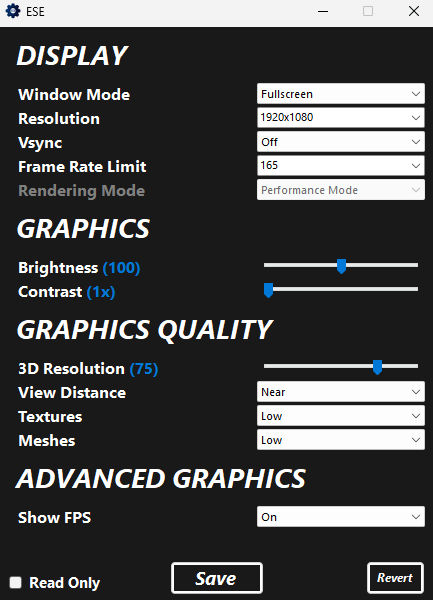

# ESE

## Overview

ESE is an External Settings Editor designed for Fortnite, providing users with additional control over various in-game settings. As of now, the editor supports Performance Mode only.

## Features

  

- **Window Mode:** Change window mode.
- **Resolution:** Adjust the game resolution, supports stretched resolution.
- **Vsync:** Enable or disable Vertical Synchronization.
- **Frame Rate Limit:** Set the games frame rate limit, supports a custom limit.
- **Brightness and Contrast:** Fine-tune your in-game brightness and contrast.
- **3D Resolution:** Modify the resolution of 3D objects.
- **View Distance, Textures, and Meshes:** Control the visual fidelity of the game.
- **Show FPS:** Toggle the display of Frames Per Second.
- **Read-Only:** Make the Fortnite configuration read-only to prevent accidental changes in-game.

## Requirements

**.NET 6 Runtime**: The application is built using .NET 6, which is a free, cross-platform, open-source framework for building applications. You must have the .NET 6 Runtime installed on your machine to run this application.

## Usage

1. **Download and Run:**
   - Download the latest release from the [Releases](https://github.com/TimVincii/ESE/releases) page.
   - Run the executable file.

2. **Modify Settings:**
   - Adjust the settings according to your preferences.
   - Click "Save" to save changes.

## Disclaimer

**Warning:** This tool will change your Fortnite settings to the values you provide. If you ever need to reset your settings completely, follow one of the methods below:

1. **In Fortnite Settings:**
   - Open Fortnite and go to the in-game video settings.
   - Locate the "Reset to Default" option.
   - Click "Reset to Default" to revert all settings.

2. **Manual Reset:**
   - Navigate to the following directory on your machine, make sure to replace "your_user" with your windows user name: `C:\Users\your_user\AppData\Local\FortniteGame\Saved\Config\WindowsClient`.
   - Locate the file named `GameUserSettings.ini`.
   - Delete `GameUserSettings.ini`.
   - Relaunch Fortnite.

## Contributing

Contributions are welcome! If you have any improvements, bug fixes, or new features, feel free to open an issue or submit a pull request.

## License

This project is licensed under the [MIT License](https://github.com/TimVincii/ESE/blob/main/LICENSE).
